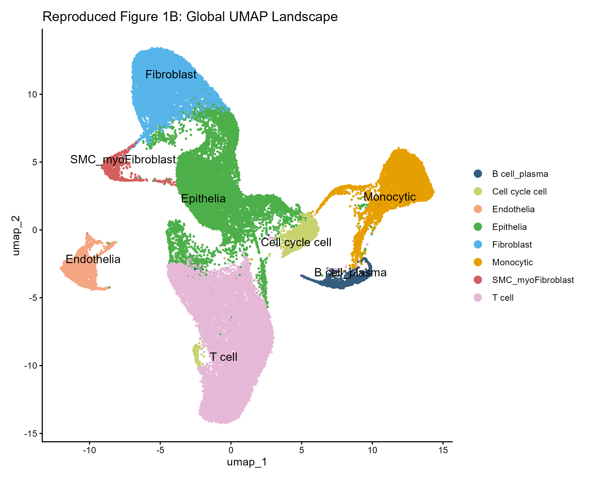
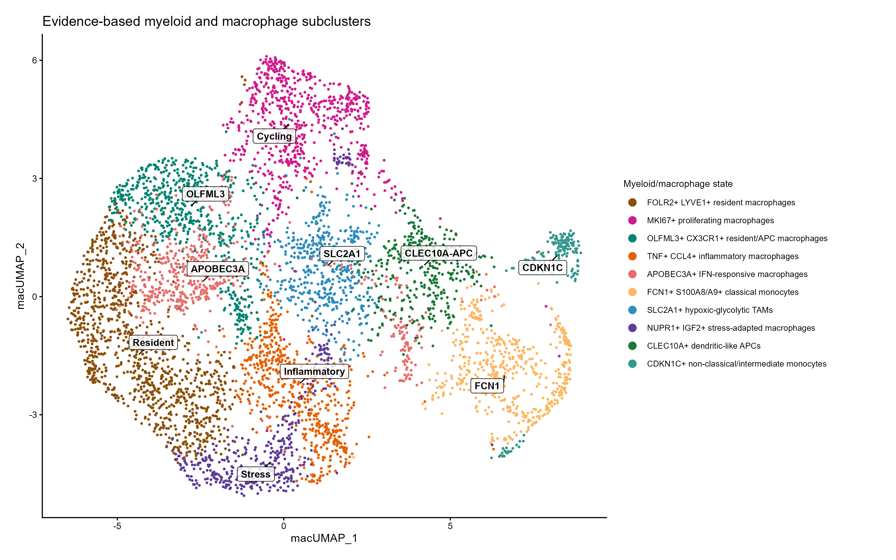
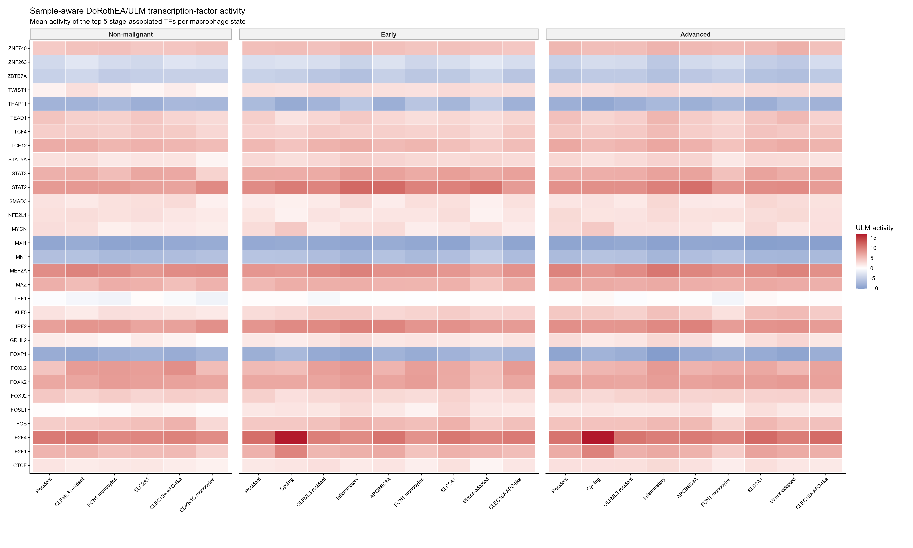
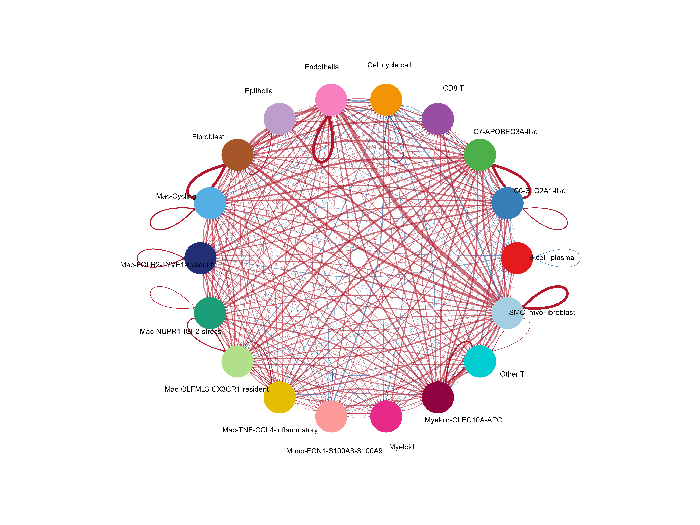

# HGSOC single-cell reanalysis (GSE184880): transcription-factor activity and cell communication in myeloid/macrophage states across stages

Reanalysis of the Xu et al. dataset GSE184880 to identify evidence-supported myeloid/macrophage states and determine how their transcription-factor activity and predicted communication programs differ across HGSOC stages.

## The question

Which transcription-factor activities and cell-communication programs distinguish evidence-supported myeloid/macrophage states across Non-malignant, Early, and Advanced HGSOC tissue groups?

## The data

- **Study:** Xu J, Fang Y, Chen K, et al. *Single-cell RNA sequencing reveals the tissue architecture in human high-grade serous ovarian cancer.* Clin Cancer Res. 2022;28(16):3590–3602. doi:[10.1158/1078-0432.CCR-22-0296](https://doi.org/10.1158/1078-0432.CCR-22-0296)
- **Public accession:** [GSE184880](https://www.ncbi.nlm.nih.gov/geo/query/acc.cgi?acc=GSE184880) (NCBI GEO; 10x Genomics single-cell RNA-seq).
- **Input:** Processed 10x matrices (`matrix.mtx`, `barcodes.tsv`, `features.tsv`) for twelve samples.
- **How to download:** Download the authors' processed matrices from the GSE184880 page, extract the 12 sample folders, and place them under `data/GSE184880/`. The full sample list and expected folder structure are in [`data/README.md`](data/README.md).
- **Data policy:** Expression matrices and `.rds` objects are excluded from GitHub; the repository contains code, small result tables, and final figures only.

### Sample design

| Group | Samples | n |
|---|---|---:|
| Non-malignant | Norm1–Norm5 | 5 |
| Early HGSOC | Cancer3, Cancer4, Cancer7 | 3 |
| Advanced HGSOC | Cancer1, Cancer2, Cancer5, Cancer6 | 4 |

## What we did

1. Applied sample-level quality control (more than 200 genes, less than 40% mitochondrial reads) and `scDblFinder`, taking 65,820 cells to 55,103 singlets, then merged the twelve samples.
2. Normalized the data, selected highly variable genes, scaled, ran PCA, assessed sample mixing, integrated by sample identity, and annotated the global atlas.
3. Reproduced the published global landscape as a pipeline-validation baseline and refined the broad myeloid annotation.
4. Audited the myeloid compartment cluster by cluster with marker-panel detection thresholds (see "Myeloid lineage audit" below), reclustered the 5,612 retained cells, and assigned biological states using multiple markers and cluster differential expression.
5. Estimated sample-aware transcription-factor activity using DoRothEA/ULM.
6. Compared stage-stratified CellChat predictions, focusing on communication involving macrophages, epithelial cells, and CD8 T cells.

## Quality control summary

Quality control had two steps: sample-level QC filtering (more than 200 detected genes and less than 40% mitochondrial reads), followed by per-sample doublet detection with `scDblFinder`. Of **65,820 cells before QC**, 6,159 (9.4%) were removed by the QC filters, leaving 59,661 cells for doublet detection (close to the 59,324 cells reported by Xu et al.). A further 4,558 cells (7.6% of those) were removed as doublets, leaving **55,103 singlets**, which is **83.7% of the cells before QC**. No doublets remained after subsetting.

| Group | Samples | Cells before QC | Removed by QC filters | Cells before doublet removal | Doublets removed | Singlets retained | Retained overall |
|---|---:|---:|---:|---:|---:|---:|---:|
| Non-malignant | 5 | 27,045 | 930 | 26,115 | 1,940 | 24,175 | 89.4% |
| Early | 3 | 14,455 | 2,480 | 11,975 | 797 | 11,178 | 77.3% |
| Advanced | 4 | 24,320 | 2,749 | 21,571 | 1,821 | 19,750 | 81.2% |
| **Total** | **12** | **65,820** | **6,159** | **59,661** | **4,558** | **55,103** | **83.7%** |

Per-sample counts:

| Sample | Group | Cells before QC | Cells before doublet removal | Doublets removed | Singlets retained | Retained overall |
|---|---|---:|---:|---:|---:|---:|
| Norm1 | Non-malignant | 6,370 | 6,281 | 450 | 5,831 | 91.5% |
| Norm2 | Non-malignant | 5,174 | 5,065 | 394 | 4,671 | 90.3% |
| Norm3 | Non-malignant | 4,475 | 4,365 | 258 | 4,107 | 91.8% |
| Norm4 | Non-malignant | 6,662 | 6,436 | 583 | 5,853 | 87.9% |
| Norm5 | Non-malignant | 4,364 | 3,968 | 255 | 3,713 | 85.1% |
| Cancer1 | Advanced | 8,823 | 7,818 | 841 | 6,977 | 79.1% |
| Cancer2 | Advanced | 4,390 | 3,699 | 226 | 3,473 | 79.1% |
| Cancer3 | Early | 5,107 | 4,744 | 355 | 4,389 | 85.9% |
| Cancer4 | Early | 4,169 | 2,479 | 125 | 2,354 | 56.5% |
| Cancer5 | Advanced | 5,892 | 5,484 | 437 | 5,047 | 85.7% |
| Cancer6 | Advanced | 5,215 | 4,570 | 317 | 4,253 | 81.6% |
| Cancer7 | Early | 5,179 | 4,752 | 317 | 4,435 | 85.6% |

Retention was lowest in Cancer4 (56.5%), the sample with the highest mean mitochondrial read percentage (19.9%), and highest in the non-malignant samples (85.1% to 91.8%).

Across samples, the median genes per cell in the retained singlets ranged from 1,313 to 3,313, the median UMIs per cell from 3,381 to 12,457, and the mean mitochondrial read percentage from 9.1% to 19.9% (highest in Cancer4). After removal of mitochondrial genes, between 17,549 and 20,041 genes remained per sample. Per-sample counts are in `results/qc_cell_counts_per_sample.csv`, `results/qc_cell_counts_summary.csv` and `results/post_doublet_subset_summary.csv`.

## How to run it

Run R from the repository root so all relative paths resolve correctly.

| Order | Script | Main output |
|---:|---|---|
| 0 | `scripts/00_project_setup.R` | Folder/package checks and `results/00_session_info.txt` |
| 1 | `scripts/01_qc_doublet_removal_and_merge.R` | `results/postQC_merged_12_samples.rds` and QC audit tables |
| 2 | `scripts/02_preprocessing_integration_global_annotation.R` | `results/02_integrated_seurat.rds` |
| 2.1 | `scripts/02.1_refine_global_annotation.R` | `results/02.1_integrated_seurat_refined.rds` |
| 2.2 | `scripts/02.2_reproduce_fig1C_fig1E.R` | Reproduction figures and sample-stage mapping tables |
| 3 | `scripts/03_macrophage_subclustering_annotation.R` | `results/03_clean_macrophages_Xu_annotated.rds`, `results/03_initial_cluster_lineage_audit.csv` and marker tables |
| 4 | `scripts/04_downstream_TF_activity_CellChat.R` | `results/04_downstream/` and `figures/04_downstream/` |

```r
source("scripts/00_project_setup.R")
source("scripts/01_qc_doublet_removal_and_merge.R")
source("scripts/02_preprocessing_integration_global_annotation.R")
source("scripts/02.1_refine_global_annotation.R")
source("scripts/02.2_reproduce_fig1C_fig1E.R")
source("scripts/03_macrophage_subclustering_annotation.R")
source("scripts/04_downstream_TF_activity_CellChat.R")
```

Stage 04 is computationally expensive and can be run separately. Intermediate `.rds` files prevent unnecessary reruns.

### Repository layout

- `scripts/`: numbered analysis code, in the order it runs
- `results/`: output tables and session information
- `figures/`: high-resolution figures used in this README and the presentation
- `data/`: accession and download instructions only (no data files)

## Requirements

- **R version:** 4.6.1 (2026-06-24), run on Windows 11 (x86_64-w64-mingw32).
- **Core packages and versions:**

| Package | Version | Package | Version |
|---|---|---|---|
| Seurat | 5.5.1 | decoupleR | 2.17.0 |
| SeuratObject | 5.4.0 | dorothea | 1.23.0 |
| scDblFinder | 1.26.7 | CellChat | 2.2.0.9001 |
| SingleCellExperiment | 1.34.0 | limma | 3.68.5 |
| batchelor | 1.28.0 | BiocSingular | 1.28.0 |
| dplyr | 1.2.1 | tidyr | 1.3.2 |
| tibble | 3.3.1 | ggplot2 | 4.0.3 |
| patchwork | 1.3.2 | pheatmap | 1.0.13 |

- The setup script checks that the required R packages are installed. The full `sessionInfo()` output for each stage (01, 02, 02.1, 02.2, 03, and 04) is saved as a stage-specific session-information file in `results/`.

Key settings are more than 200 detected genes and less than 40% mitochondrial reads; `LogNormalize` with scale factor 10,000; 2,000 `vst` HVGs; 10 dimensions; CCA integration by `orig.ident`; UMAP with 30 neighbors, minimum distance 0.3, and cosine metric; and clustering resolution 0.08. Random seeds are fixed throughout (`set.seed(42)`).

## Results

### Reproduced global cell landscape



The reanalysis recovered the eight principal populations reported in the baseline study: T cells, epithelial cells, fibroblasts, monocytic/myeloid cells, endothelial cells, cycling cells, B/plasma cells, and smooth-muscle/myofibroblast cells. This supports the validity of the preprocessing and annotation workflow, although exact UMAP geometry and cluster proportions were not expected to match because of software-version and parameter differences.

### Myeloid lineage audit

Before macrophage-specific analysis, the reclustered myeloid compartment (11 initial clusters, 6,625 cells) was audited in `scripts/03_macrophage_subclustering_annotation.R`. Each cluster was scored against marker panels for a myeloid core (LST1, TYROBP, FCER1G, CTSS, AIF1, CD68), B cells (PAX5, MS4A1, CD79A, CD19, BANK1), T cells (CD3D, CD3E, TRBC1, TRBC2), conventional dendritic cells (cDC: CD1C, FCER1A, CD1E, CLEC10A), plasmacytoid dendritic cells (pDC: CLEC4C, LILRA4, GZMB, DNASE1L3), epithelial cells and fibroblasts. Each score is the mean, across the panel genes, of the fraction of cluster cells detecting the gene.

A cluster was **kept** only if all of the following held:

- myeloid-core score at least 0.45 and higher than every immune contaminant score;
- B-cell score below 0.25 and T-cell score below 0.25;
- cDC score below 0.40 and pDC score below 0.20.

Epithelial (at least 0.25) and fibroblast (at least 0.20) scores were recorded as warnings, not exclusion criteria, because ambient RNA can produce low-level expression of these genes in genuine myeloid cells. Three retained clusters (3, 5 and 6) carried an epithelial warning.

| Initial cluster | Cells | Myeloid core | cDC | pDC | B cell | Decision |
|---|---:|---:|---:|---:|---:|---|
| 10 | 283 | 0.92 | **0.57** | 0.04 | 0.03 | Excluded: cDC above 0.40 |
| 9 | 287 | 0.46 | 0.04 | **0.28** | 0.04 | Excluded: pDC above 0.20 |
| 7 | 443 | **0.17** | 0.03 | 0.01 | **0.69** | Excluded: B-cell-like (also reassigned to B/plasma in script 02.1) |
| 8 retained clusters | 5,612 | 0.60 to 0.98 | at most 0.12 | at most 0.03 | at most 0.02 | Kept |

Cluster 10 had a high myeloid-core score but still failed the cDC limit, so the rule is threshold-based rather than "highest score wins". In total 1,013 of 6,625 cells were excluded and 5,612 were retained. The full table is in `results/03_initial_cluster_lineage_audit.csv`. The thresholds are analyst-defined.

### Evidence-supported myeloid/macrophage states



Ten states were resolved within the cleaned myeloid/macrophage compartment:

- FOLR2/LYVE1 resident macrophages
- OLFML3/CX3CR1 resident/APC macrophages
- cycling macrophages
- TNF/CCL4 inflammatory macrophages
- APOBEC3A-like interferon-responsive macrophages
- FCN1/S100A8/S100A9 classical monocytes
- SLC2A1-like hypoxic/glycolytic macrophages
- NUPR1/IGF2 stress-adapted macrophages
- CLEC10A APC-like myeloid cells
- CDKN1C non-classical/intermediate monocytes

Labels were deliberately descriptive and evidence-based rather than forced into the paper's single-marker taxonomy.

The CLEC10A APC-like state (357 cells, 6.4% of the 5,612 retained cells) is a boundary case. It appeared only after reclustering the retained clusters, and no initial cluster crossed the cDC limit. CLEC10A is detected in 55% of its cells (12% in other cells), CD1C in 15% and FCER1A in 11%, alongside EREG, IL10 and MARCO; CLEC10A, CD1C and FCER1A are part of the cDC audit panel, so the state is labelled APC-like myeloid rather than macrophage. See `results/03_clean_macrophage_top20_markers.csv`.

### Stage-associated transcription-factor activity



The heatmap summarizes sample-aware DoRothEA/ULM activity patterns across macrophage states and Non-malignant, Early, and Advanced groups.

### Advanced versus Non-malignant communication



The differential CellChat network highlights predicted communication changes between Advanced HGSOC and Non-malignant tissue.

## Team

- **Hiba Hussein**: [GitHub profile](https://github.com/hibakhair24)
- **Leqaa Ibrahim**: [GitHub profile](https://github.com/leqaaibrahim)
- **Nour Ibrahim**: [GitHub profile](https://github.com/noour1762006)
